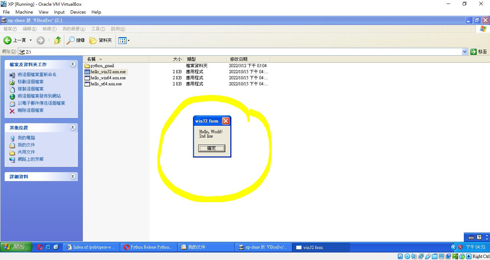

# FASM_win32_win64_hello_world
batch file to build the testing program, hello world


download FASM, https://flatassembler.net/download.php  
decompress to default folder as you like. mine was E:\FASM\


### download this project folder E:\FASM\my_project\win_hello


### Edit batch file for your FASM and path stpred  
[my_project/win_hello/build.bat](my_project/win_hello/build.bat)  
```
SET FASM=E:\FASM  
```

### drag the asm file and then drop to build.bat  
job done, ie. hello_win32.asm.exe will be generated.

### win32 XP testing



